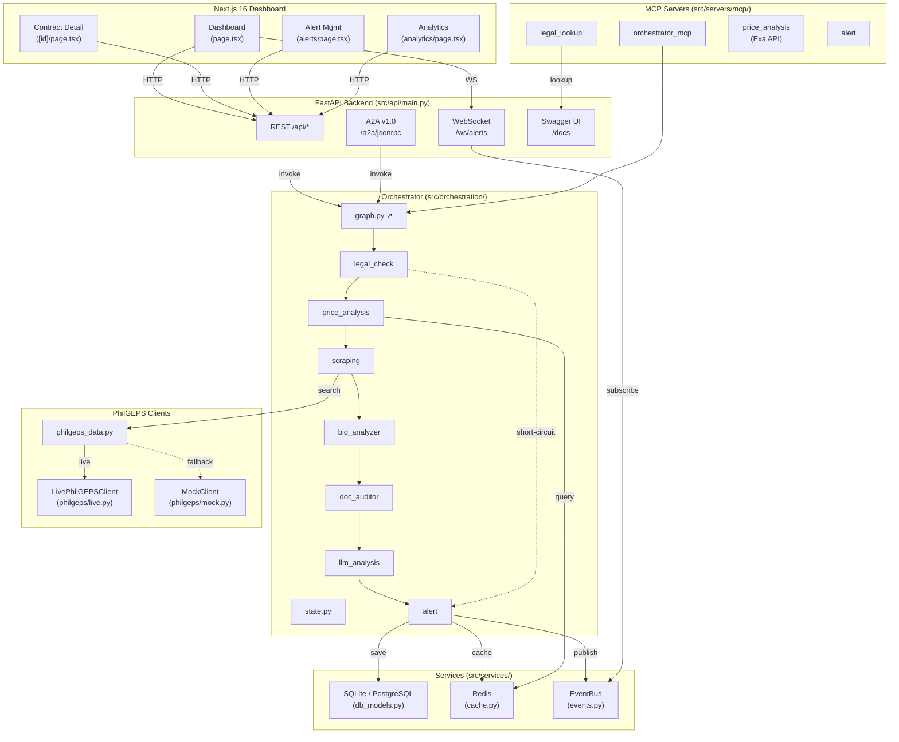

# ProcuGents

Philippine Government Procurement Anomaly Detection using Multi-Agent AI.

## Overview

ProcuGents is an AI-powered system that detects procurement anomalies in
Philippine government contracts. It uses a **7-agent LangGraph pipeline** to
analyze contracts against **RA 12009 (2024)** thresholds, **RA 9184 IRR**,
and **COA 2023-004** — flagging price inflation, legal violations, bid
collusion, missing documents, and generating COA-style disallowance reports.

The system degrades gracefully: missing LLM API keys → rule-based fallback;
no Redis → estimated baselines; no live PhilGEPS → deterministic mock data.

---

## Project Structure

```
procugents/
├── src/
│   ├── api/
│   │   └── main.py                 # FastAPI (REST + WebSocket + A2A)
│   ├── orchestration/
│   │   ├── graph.py                # LangGraph wiring + conditional router
│   │   ├── orchestrator.py         # Public entry point (sync, backwards-
│   │   │                           #   compatible re-exports)
│   │   ├── state.py                # ProcurementState TypedDict + thresholds
│   │   └── agents/
│   │       ├── __init__.py
│   │       ├── legal.py            # SVP / PhilGEPS threshold check
│   │       ├── price.py            # 30 % inflation vs market baseline
│   │       ├── scraping.py         # PhilGEPS lookup (async-bridged)
│   │       ├── bid.py              # <3 bidders, dummy bidders, HoPE, NFCC
│   │       ├── doc.py              # Missing reg / permit / security / PCAB
│   │       ├── llm.py              # Optional LLM deep analysis (fallback
│   │       │                       #   chain: OpenCode → OpenAI → Anthropic)
│   │       └── alert.py            # Aggregates flags, COA report, EventBus
│   ├── servers/
│   │   ├── a2a_server.py           # A2A v1.0 (JSON-RPC 2.0, SSE, Agent Card)
│   │   └── mcp/
│   │       ├── orchestrator_mcp.py # Entry-point MCP (sync, full params)
│   │       ├── legal_lookup.py     # Rule-engine JSON lookup
│   │       ├── price_analysis.py   # Exa API price search
│   │       ├── alert.py            # Alert create / send / resolve
│   │       ├── philgeps_data.py    # Data-access layer (live→mock fallback)
│   │       ├── philgeps_mock.py    # Deterministic fixture data (6 items)
│   │       ├── philgeps_scraper.py # Legacy scraper entry (unused)
│   │       └── philgeps/           # Pluggable PhilGEPS client registry
│   │           ├── __init__.py     #  get_client(force="mock"|"live")
│   │           ├── mock.py         #  MockClient (always returns fixtures)
│   │           └── live.py         #  LivePhilGEPSClient (HTML scraper)
│   ├── services/
│   │   ├── cache.py                # Redis (env-configurable URL)
│   │   ├── database.py             # Engine, session, init_db, Pydantic
│   │   ├── db_models.py            # SQLAlchemy declarative models
│   │   └── events.py               # In-process EventBus (→WS)
│   └── scripts/
│       └── auto_crawl.py           # Scheduled PhilGEPS scan + 5-agent
├── web/                            # Next.js 16 + Shadcn v4 dashboard
│   └── src/
│       ├── app/
│       │   ├── page.tsx            # Dashboard (stats, live alerts, filters)
│       │   ├── analytics/page.tsx  # Per-agency cohort analytics
│       │   ├── alerts/page.tsx     # Alert management (resolve workflow)
│       │   ├── contracts/[id]/page.tsx  # Deep-dive contract report
│       │   └── api/                # Next.js API route proxies
│       └── components/
│           ├── flag-panel.tsx
│           └── ui/                 # shadcn components
├── docs/
│   ├── legal_rule_engine.json      # IIUEEU classes, per-agent flags, thresholds
│   ├── a2a-integration.md
│   ├── agent-prompts.md
│   ├── data-schema-detail.md
│   ├── legal-rule-engine.md
│   ├── mcp-server-specs.md
│   └── migrations.md
├── tests/
│   ├── conftest.py
│   ├── test_orchestrator.py        # Per-node + integration tests
│   ├── test_a2a_v1.py              # A2A protocol compliance (663 lines)
│   ├── test_alert_events.py
│   ├── test_events.py
│   ├── test_migrations.py          # Alembic baseline tests
│   └── test_philgeps_client.py     # Mock + live client coverage
├── alembic/
│   ├── env.py
│   ├── script.py.mako
│   └── versions/
│       └── 2026_07_08_00_baseline.py  # Dialect-aware (JSONB→JSON)
├── docker-compose.yaml             # PostgreSQL + Redis + API + Web
├── Dockerfile
├── pyproject.toml                  # Python 3.11+, uv-managed
└── README.md
```

---

## Architecture

### Multi-Agent Workflow (7 nodes)

```
      ┌──────────────┐
      │  Legal Check │  ← RA 12009 SVP ceiling (PHP 1 M)
      └──────┬───────┘
             │
    ┌────────┴────────┐
    │ threshold       │ threshold
    │ compliant       │ violated
    └────────┬────────┘
             │
      ┌──────▼───────┐
      │  Price       │  ← COA 2023-004: >30 % above market => Excessive
      │  Analysis    │
      └──────┬───────┘
             │
      ┌──────▼───────┐
      │  Scraping    │  ← PhilGEPS lookup (live scraper → mock fallback)
      └──────┬───────┘
             │
      ┌──────▼───────┐
      │  Bid         │  ← <3 bidders, dummy bidders, HoPE, NFCC
      │  Analyzer    │
      └──────┬───────┘
             │
      ┌──────▼───────┐
      │  Doc         │  ← Missing PhilGEPS reg / permit / security / PCAB
      │  Auditor     │
      └──────┬───────┘
             │
      ┌──────▼───────┐
      │  LLM         │  ← Optional: OpenCode → OpenAI → Anthropic
      │  Analysis    │
      └──────┬───────┘
             │
      ┌──────▼───────┐
      │  Alert       │  ← Aggregates all flags → final_risk_score
      │              │  → COA disallowance report
      └──────────────┘  → EventBus → WebSocket → Dashboard

Short-circuit: if Legal Check finds an SVP violation, the graph routes
*straight* to Alert — no LLM tokens wasted on unambiguously illegal
procurements.
```

### Workflow States (`AnalysisStatus` enum)

| State          | Description |
|----------------|-------------|
| `pending`      | Contract received |
| `legal_check`  | RA 12009 threshold check |
| `price_check`  | Price inflation analysis |
| `scraping`     | PhilGEPS data retrieval |
| `alerting`     | Alerts created for anomalies |
| `completed`    | Analysis done, no alerts |
| `error`        | Workflow failed |

### Per-Agent Outputs

| Agent      | Flags                       | IIUEEU  | Risk Score |
|------------|-----------------------------|---------|------------|
| Legal      | svp_over_threshold          | I       | 5 |
| Price      | price_30pct_above_market    | E       | 4 |
| Bid        | less_than_3_bidders,        | IR, I   | 4–5 |
|            | dummy_bidders,              |         |
|            | alt_mode_no_hope_approval,  |         |
|            | insufficient_nfcc           |         |
| Doc        | missing_philgeps_registration, | IR   | 3–4 |
|            | missing_business_permit,    |         |
|            | missing_bid_security,       |         |
|            | missing_pcab_license,       |         |
|            | alt_mode_no_hope_approval   |         |
| LLM        | llm_textual_anomaly         | U       | 3 |
| Alert      | Aggregates all →            | I/E/UN  | max(agent) |
|            | final_risk_score (1–5)      |         |

---

## Agents

| # | Agent | File | Role |
|---|-------|------|------|
| 1 | **Legal Check** | `agents/legal.py` | Validates SVP ceiling (PHP 1M),
|   |                 |                   | PhilGEPS posting requirement (>PHP 50k) |
| 2 | **Price Analysis** | `agents/price.py` | Detects price >30% above market
|   |                   |                    | baseline (COA 2023-004 Sec 4.2) |
| 3 | **PhilGEPS Scraper** | `agents/scraping.py` | Async PhilGEPS lookup
|   |                     |                       | (thread-bridged for sync graph) |
| 4 | **Bid Analyzer** | `agents/bid.py` | <3 bidders, dummy bidders (shared
|   |                  |                  | address/directors), alt-mode w/o HoPE,
|   |                  |                  | insufficient NFCC.
|   |                  |                  | Flags carry ``synthetic`` provenance. |
| 5 | **Doc Auditor** | `agents/doc.py` | Missing PhilGEPS registration,
|   |                 |                 | business permit, bid security, PCAB
|   |                 |                 | license. Flags carry ``synthetic``. |
| 6 | **LLM Analysis** | `agents/llm.py` | Optional LLM deep analysis.
|   |                   |                  | Provider chain:
|   |                   |                  | OpenCode (free) → OpenAI → Anthropic.
|   |                   |                  | Silent fallback when no key set. |
| 7 | **Alert** | `agents/alert.py` | Aggregates all flags → final_risk_score,
|   |            |                    | persists to DB, publishes to EventBus,
|   |            |                    | generates COA-style disallowance report.
|   |            |                    | Triggers at IIUEEU I/E/UN or severity ≥4. |

---

## Key Files

### Orchestration

| File | Purpose |
|------|---------|
| `src/orchestration/graph.py` | LangGraph `StateGraph` wiring + conditional router |
| `src/orchestration/state.py` | `ProcurementState` TypedDict + all threshold constants |
| `src/orchestration/orchestrator.py` | Public `analyze_procurement()` entry point |
| `src/orchestration/agents/*.py` | One module per agent node |

### API

| File | Purpose |
|------|---------|
| `src/api/main.py` | FastAPI app (REST, WebSocket `/ws/alerts`, A2A `/a2a/jsonrpc`) |

### MCP Servers

| Tool | File | Description |
|------|------|-------------|
| `analyze_procurement` | `orchestrator_mcp.py` | Full 7-node pipeline (sync) |
| `quick_legal_check` | `orchestrator_mcp.py` | SVP threshold check |
| `quick_price_check` | `orchestrator_mcp.py` | Price vs market (requires market_price) |
| `create_alert` | `orchestrator_mcp.py` | Create alert |
| `lookup_legal_citation` | `legal_lookup.py` | Flag code → citation + IIUEEU |
| `list_flags_by_agent` | `legal_lookup.py` | All flags for an agent |
| `get_thresholds` | `legal_lookup.py` | Procurement thresholds |
| `search_procurement_prices` | `price_analysis.py` | Exa API search |
| `compare_market_price` | `price_analysis.py` | Price vs 70% estimate |
| `create_alert` | `alert.py` | Create, query, send, resolve alerts |
| `get_alerts` | `alert.py` | |
| `send_alert` | `alert.py` | |
| `resolve_alert` | `alert.py` | |

### PhilGEPS Client Architecture

```
src/servers/mcp/philgeps/
    __init__.py   →  get_client() returns MockClient | LivePhilGEPSClient
    mock.py       →  MockClient (fixture data, never returns None)
    live.py       →  LivePhilGEPSClient (HTML scraper, needs PHILGEPS_LIVE=1)

src/servers/mcp/
    philgeps_data.py   →  Data-access API: search_philgeps, get_agency_procurement,
                          check_notice_compliance. Falls back to mock on None.
    philgeps_mock.py   →  MOCK_PROCUREMENTS fixture (6 items across 5 agencies)
```

### Services

| File | Purpose |
|------|---------|
| `src/services/database.py` | SQLAlchemy engine + session + `init_db` (SQLite→create_all,
|                           | PostgreSQL→migrations-only) |
| `src/services/db_models.py` | Declarative models (ProcurementAnalysis, Alert, Agency) |
| `src/services/cache.py` | Redis client (env-configurable URL) |
| `src/services/events.py` | In-process EventBus (channel `dashboard:updates`) |

---

## API Endpoints

### Core Analysis

```bash
POST /api/analyze
{
  "contract_id": "PO-2024-001",
  "contract_description": "Office Chairs",
  "contract_amount": 500000
}
```

### Analytics & Stats

| Method | Endpoint | Description |
|--------|----------|-------------|
| GET | `/api/stats` | Total, anomalies, alerts, compliance rate |
| GET | `/api/analyses?min_risk=&max_risk=&alerted_only=&agency=&q=` | Filtered list |
| GET | `/api/analyses/{id}` | Full detail (all agents' outputs) |
| GET | `/api/analytics/cohorts` | Per-agency aggregation |

### Alert Management

| Method | Endpoint | Description |
|--------|----------|-------------|
| GET | `/api/alerts?status=&severity=&contract_id=` | List alerts |
| PATCH | `/api/alerts/{id}` | Resolve with notes |

### A2A v1.0 Protocol

| Method | Endpoint | Description |
|--------|----------|-------------|
| POST | `/a2a/jsonrpc` | JSON-RPC 2.0 envelope |
| GET | `/a2a/card` | Agent Card discovery |
| GET | `/a2a/tasks/{id}` | Get task state |
| POST | `/a2a/tasks/{id}:cancel` | Cancel task |
| GET | `/a2a/tasks/{id}:subscribe` | SSE stream of state transitions |

### WebSocket

| Path | Purpose |
|------|---------|
| `/ws/alerts` | Real-time alert events → dashboard (EventBus-backed) |

### API Documentation

| URL | Description |
|-----|-------------|
| `/docs` | Interactive Swagger UI (auto-generated from FastAPI) |
| `/openapi.json` | OpenAPI 3.1 JSON schema |

### Utility

| Method | Endpoint | Description |
|--------|----------|-------------|
| POST | `/api/crawl?agency=` | Auto-crawl PhilGEPS + analyze |
| GET | `/api/health` | Health check |

---

## Architecture Diagram



---

## Legal Rule Engine

File: `docs/legal_rule_engine.json`

Every agent flag carries:

| Field | Description | Example |
|-------|-------------|---------|
| `flag` | Machine-readable code | `dummy_bidders` |
| `citation` | Legal citation | `COA 2023-004 Sec 5.1` |
| `law_source` | Primary law | `COA 2023-004`, `RA 12009`, `RA 9184 IRR` |
| `iiueeu` | COA classification | `I` (Illegal), `IR` (Irregular),
|         |                    | `U` (Unnecessary), `E` (Excessive),
|         |                    | `EX` (Extravagant), `UN` (Unconscionable) |
| `severity` | Ordinal 1–5 | `5` |

### Thresholds

| Threshold | Value | Source |
|-----------|-------|--------|
| SVP ceiling | PHP 1,000,000 | RA 12009 Sec 26 |
| PhilGEPS posting required | > PHP 50,000 | RA 12009 Sec 20.1 |
| Price excess benchmark | >30% above market | COA 2023-004 Sec 4.2 |
| Minimum bidders (open) | 3 | RA 9184 IRR Sec 52.1 |

---

## Tech Stack

| Layer | Technology |
|-------|------------|
| Orchestration | LangGraph |
| Agents | MCP (Model Context Protocol) |
| Communication | A2A v1.0 Protocol |
| Database | PostgreSQL (SQLAlchemy + Alembic) |
| Cache | Redis |
| Frontend | Next.js 16 + Shadcn v4 |
| LLM | OpenCode (free) → OpenAI → Anthropic |
| Scraper | httpx (live PhilGEPS) / mock fixtures |
| Linting | ruff + ty |

---

## Quick Start

```bash
# Clone
git clone https://github.com/leodyversemilla07/procugents.git
cd procugents

# Install
uv sync

# Set API key (free at https://opencode.ai/settings/api-keys)
export OPENCODE_API_KEY="your-key-here"

# Run tests (109 passing)
python -m pytest tests/ -v

# Run API server
python -m src.api.main

# Run web UI
cd web && pnpm dev

# Run orchestrator standalone (print analysis of a sample contract)
python -m src.orchestration.orchestrator
```

## Docker

```bash
docker-compose up --build
```

## License

MIT